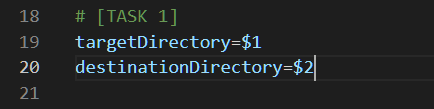

# Automated Backup Script Using Linux Shell Scripting

This project is part of the **IBM Data Engineering Professional Certificate** and represents the final hands-on lab for the course  
**Hands-on Introduction to Linux Commands and Shell Scripting**.

The goal of this project is to build an automated backup solution using **Bash scripting** that identifies recently modified files, archives them, and schedules the process to run automatically using **cron jobs**.

---

## 🧠 Project Scenario

You are a lead Linux developer at **ABC International Inc.**, responsible for creating a reliable backup solution.

The company requires a script that:
- Identifies encrypted password files updated within the last 24 hours
- Compresses and archives them automatically
- Stores backups in a designated directory
- Runs on a scheduled basis without manual intervention

---

## 🛠 Tools & Technologies

- **Linux / UNIX**
- **Bash Shell Scripting**
- **cron** (Job Scheduling)
- **tar & gzip**
- **wget / unzip**
- Linux file system utilities

---

## 📋 Project Tasks & Implementation

### 🔹 Task 1: Set Script Arguments
Defined variables to store the target directory and destination directory passed as command-line arguments.

---

### 🔹 Task 2: Display Argument Values
Printed the values of the input directories to validate user input.

📸 *Screenshot:* `02-Display_Values.png`

---

### 🔹 Task 3: Capture Current Timestamp
Created a variable to store the current timestamp in seconds for time-based comparisons.

📸 *Screenshot:* `03-CurrentTS.png`

---

### 🔹 Task 4: Define Backup File Name
Constructed a dynamic backup filename using the current timestamp.

📸 *Screenshot:* `04-Set_Value.png`

---

### 🔹 Task 5: Determine Original Absolute Path
Stored the absolute path of the current working directory.

📸 *Screenshot:* `05-Define_Variable.png`

---

### 🔹 Task 6: Determine Destination Absolute Path
Resolved and validated the absolute path of the destination directory.

📸 *Screenshot:* `06-Define_Variable.png`

---

### 🔹 Task 7: Change to Target Directory
Navigated safely to the target directory containing files to be backed up.

📸 *Screenshot:* `07-Change_Directory.png`

---

### 🔹 Task 8: Calculate Yesterday’s Timestamp
Calculated the timestamp corresponding to 24 hours prior to the current time.

📸 *Screenshot:* `08-YesterdayTS.png`

---

### 🔹 Task 9: List Files and Directories
Iterated over all files and directories using a wildcard loop.

📸 *Screenshot:* `09-List_AllFilesandDirectories.png`

---

### 🔹 Task 10: Check File Modification Time
Used an `if` condition to identify files modified within the last 24 hours.

📸 *Screenshot:* `10-IF_Statement.png`

---

### 🔹 Task 11: Add Files to Backup Array
Appended recently modified files to an array for batch archiving.

📸 *Screenshot:* `11-Add_File.png`

---

### 🔹 Task 12: Create Compressed Backup
Archived and compressed selected files into a `.tar.gz` backup file.

📸 *Screenshot:* `12-Create_Backup.png`

---

### 🔹 Task 13: Move Backup File
Moved the generated backup file to the destination directory.

📸 *Screenshot:* `13-Move_Backup.png`

---

### 🔹 Task 14: Save Script File
Saved and downloaded the completed backup script.

📸 *Screenshot:* `14-Save_File.png`

---

### 🔹 Task 15: Make Script Executable
Changed file permissions and verified executability.

📸 *Screenshot:* `15-executable.png`

---

### 🔹 Task 16: Test Backup Script
Tested the script using a sample dataset to ensure successful backup creation.

📸 *Screenshot:* `16-backup-complete.png`

---

### 🔹 Task 17: Schedule Backup Using Cron
Scheduled the backup script to run automatically every 24 hours using `crontab`.

📸 *Screenshot:* `17-crontab.png`

---

## 🎯 Key Learning Outcomes

- Writing reusable and parameterized shell scripts
- Working with timestamps and file metadata
- Automating file backup processes
- Using arrays and loops in Bash
- Scheduling tasks using cron jobs
- Building production-style Linux automation scripts

---

## 📌 Notes

- Screenshots included in this repository document each task completion.
- The project emphasizes **automation, reliability, and scripting best practices**.
- This script can be extended for real-world system administration and data engineering workflows.

---

*Built with Bash, timestamps, and a healthy respect for cron jobs.*
