# Relational Database Administration Capstone

This project represents the final hands-on assignment for the **Relational Database Administration** course, part of the **IBM Data Engineering Professional Certificate**. It demonstrates practical proficiency in managing, securing, and optimizing relational database management systems (RDBMS) including PostgreSQL and MySQL, as well as utilizing modern data exploration tools like Datasette.

## Project Scenario

Acting as the Lead Database Administrator (DBA), the objective was to manage a heterogeneous database environment. The scope of work included implementing security protocols via Role-Based Access Control (RBAC), ensuring data durability through backup and recovery strategies, and optimizing query performance using indexing. [cite_start]Additionally, the project required the implementation of automation scripts to handle routine maintenance tasks, simulating a real-world production environment[cite: 15, 215, 317].

## Tools & Technologies

* **RDBMS:** PostgreSQL 13.x, MySQL 8.0
* **Data Exploration:** Datasette
* **Administration Tools:** PostgreSQL CLI, MySQL CLI, pgAdmin
* **Scripting & Automation:** Bash Shell Scripting
* **Containerization:** Docker (Theia environment)

## Project Tasks & Implementation

The project is divided into three distinct modules focusing on PostgreSQL, MySQL, and Datasette.

### Part 1: PostgreSQL Security and Backup

The primary focus of this module was user management and disaster recovery configuration.

**1. Configuration Analysis**
Analyzed the server configuration to determine connection limits, ensuring the environment is scaled correctly for expected traffic.

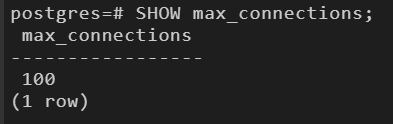

**2. User Management (RBAC)**
Created a dedicated user `backup_operator` to segregate duties. Instead of assigning direct permissions, a specific role named `backup` was created to adhere to the principle of least privilege.

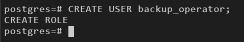
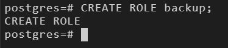

**3. Granting Privileges**
Configured access controls by granting the `backup` role connection rights to the `tolldata` database and `SELECT` permissions on relevant schema tables. This role was then assigned to the `backup_operator`.

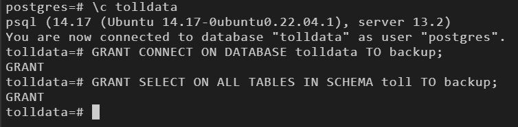
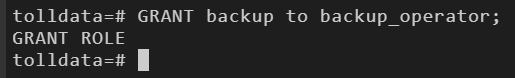

**4. Disaster Recovery (Backup)**
Performed a logical backup of the `tolldata` database using pgAdmin, exporting the schema and data into a TAR archive format to ensure data portability and recovery capability.

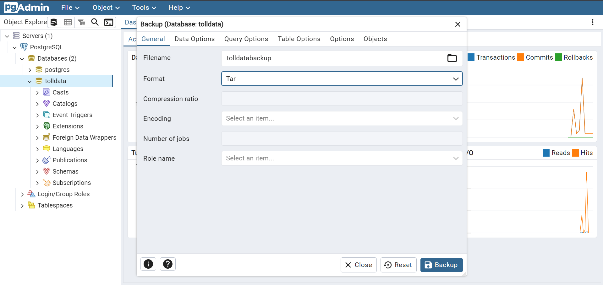

---

### Part 2: MySQL Recovery, Tuning, and Automation

This module focused on restoring data integrity, optimizing query performance, and automating maintenance workflows.

**1. Data Recovery**
Restored the `billingdata` database from a SQL dump file to simulate recovery from a critical failure or migration event. Verified the integrity of the restored tables.

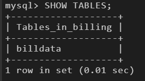

**2. Storage Analysis**
Analyzed table metadata to determine disk usage and data size, a critical step for capacity planning.

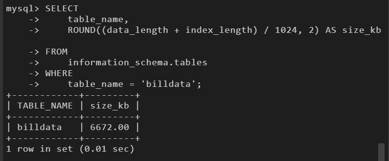

**3. Performance Tuning (Indexing)**
Executed a baseline analysis of a high-latency query on the `billdata` table. Identified performance bottlenecks and implemented a B-Tree index on the filtered column (`billedamount`).

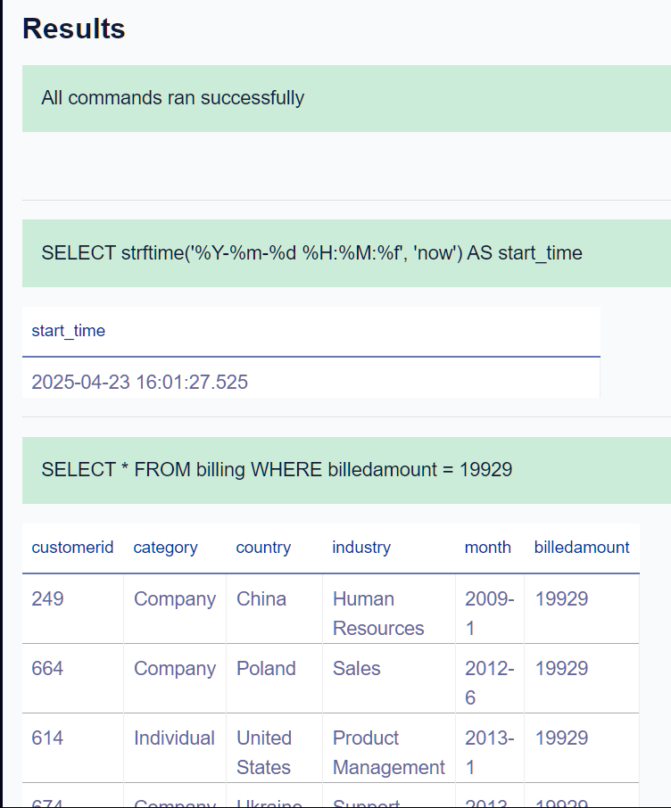
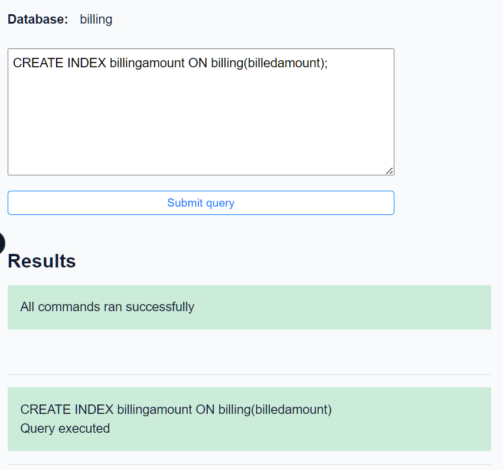

**4. Performance Validation**
Re-executed the query post-indexing to quantify performance gains. Documented the reduction in execution time resulting from the optimization.

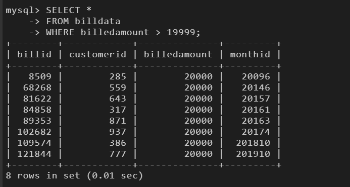

**5. Architecture Analysis**
Audited the database storage engines to confirm support for specific engines (e.g., MyISAM) and verified the active engine for production tables.

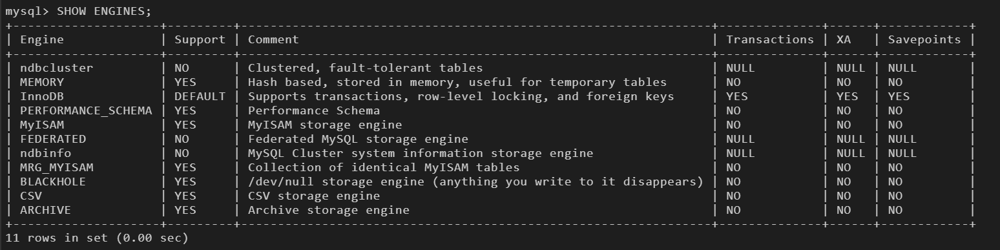
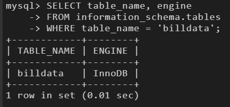

**6. Automation (Bash Scripting)**
Developed a shell script (`mybackup.sh`) to automate the backup of all databases. The script integrates `mysqldump`, dynamic timestamp generation, and directory management to create organized, daily backups without manual intervention.

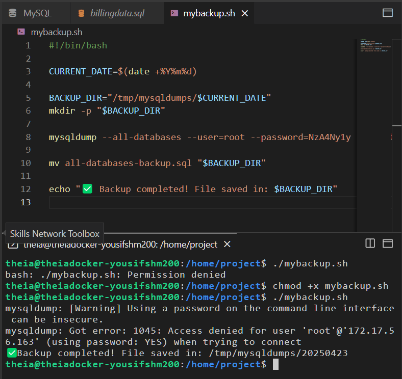

---

### Part 3: Datasette Exploration and Views

The final module utilized Datasette for lightweight data exploration and view abstraction.

**1. Data Ingestion**
Imported raw billing data from CSV format into the database system, ensuring correct schema mapping.

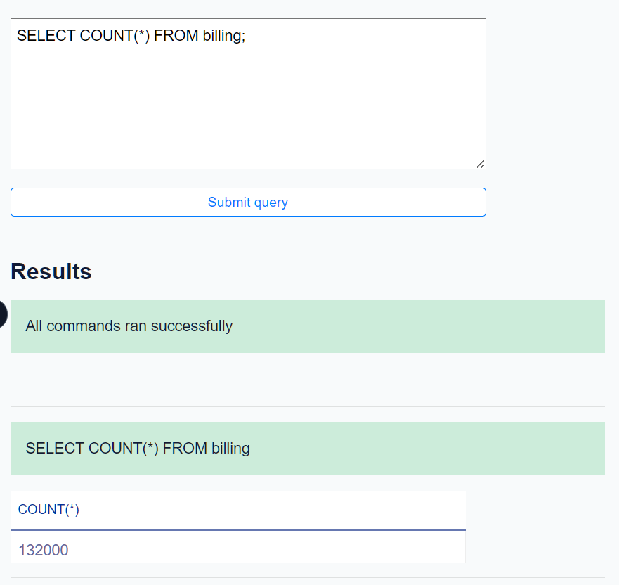

**2. View Creation**
Designed a database view (`basicbilldetails`) to abstract complex underlying table structures and provide a simplified interface for reporting users.

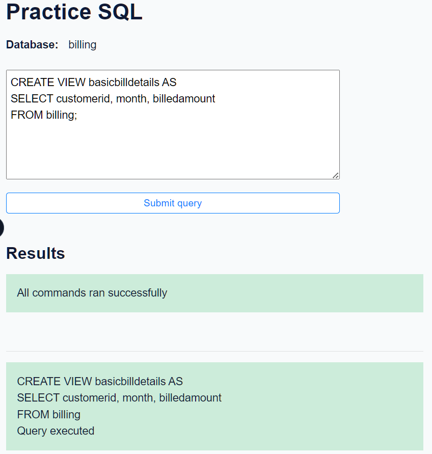

**3. Indexing in Datasette**
Applied indexing strategies within the Datasette environment to optimize filter queries on billing amounts, mirroring the optimization techniques used in MySQL.

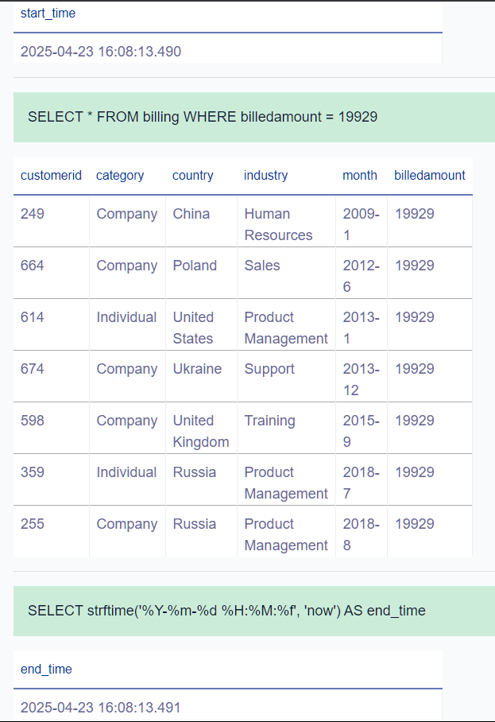

## Key Learning Outcomes

* **Security Best Practices:** Implementation of RBAC and the principle of least privilege in PostgreSQL.
* **Database Optimization:** practical application of Indexing to reduce query execution time and server load.
* **Disaster Recovery:** Execution of backup and restore procedures across different RDBMS platforms.
* **Automation:** Writing robust Bash scripts to automate database maintenance tasks, reducing operational toil.
* **Data Engineering workflows:** Experience with data ingestion, schema design, and view creation for analytics.

## Notes

* Screenshots represent the state of the system after successful execution of administrative commands.
* The automation script includes error handling and timestamping to ensure reliability in a production context.
