# ETL Data Pipelines with Apache Airflow and BashOperator

This project constitutes the final capstone for the **ETL and Data Pipelines with Shell, Airflow and Kafka** course, part of the **IBM Data Engineering Professional Certificate**. It demonstrates the design and orchestration of an Automated ETL pipeline using Apache Airflow to process multi-format traffic data.

## Project Scenario

[cite_start]In this scenario, I assumed the role of a Data Engineer at a data analytics consulting firm[cite: 381]. [cite_start]The business objective was to decongest national highways by analyzing road traffic data collected from various toll plazas[cite: 382].

[cite_start]The challenge lay in the fragmented IT infrastructure: each highway operator submitted data in different file formats (CSV, TSV, and Fixed-Width)[cite: 383]. [cite_start]The primary engineering goal was to build a consolidated pipeline to extract, unify, and transform this heterogeneous data into a single analytical dataset[cite: 384].

## Tools & Technologies

* **Orchestration:** Apache Airflow (DAGs, BashOperator)
* **Scripting:** Python (DAG definition), Bash (Data processing commands)
* **Data Formats:** CSV, TSV, Fixed-Width Text
* **Utilities:** `tar`, `cut`, `paste`, `tr`, `curl`

## Project Tasks & Implementation

[cite_start]The pipeline was constructed using the `BashOperator` to leverage Linux command-line utilities for high-performance text processing[cite: 421].

### 1. Environment Setup and DAG Initialization
[cite_start]Defined the Airflow DAG (`ETL_toll_data`) with specific default arguments, including a daily schedule and retry policies to ensure pipeline reliability in a production setting[cite: 425, 428].

* [cite_start]**DAG Arguments:** configured owner, start date, and failure callbacks[cite: 425].
* [cite_start]**Definition:** set the schedule interval to run once daily[cite: 428].

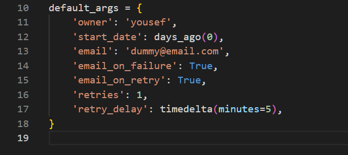
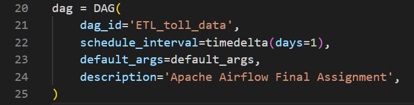

### 2. Data Extraction (Heterogeneous Sources)
[cite_start]The pipeline begins by ingesting a raw compressed dataset and extracting specific fields from three distinct file formats[cite: 433, 436, 438, 440].

* [cite_start]**Unzip Data:** Decompresses the `tolldata.tgz` archive[cite: 433].
* [cite_start]**CSV Extraction:** Extracts `Rowid`, `Timestamp`, `Anonymized Vehicle number`, and `Vehicle type` from `vehicle-data.csv`[cite: 436].
* [cite_start]**TSV Extraction:** Extracts `Number of axles`, `Tollplaza id`, and `Tollplaza code` from `tollplaza-data.tsv`[cite: 438].
* [cite_start]**Fixed-Width Extraction:** Extracts `Type of Payment code` and `Vehicle Code` from `payment-data.txt`[cite: 440].

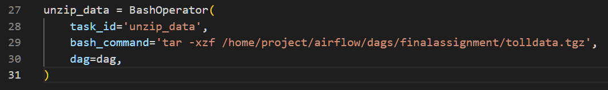
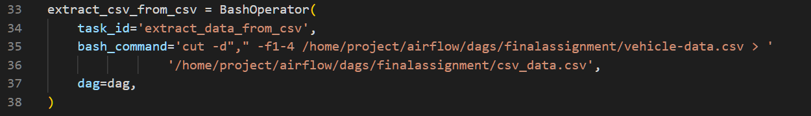
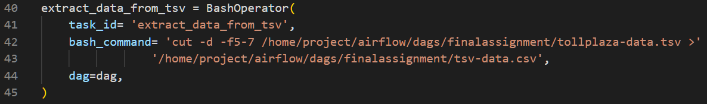
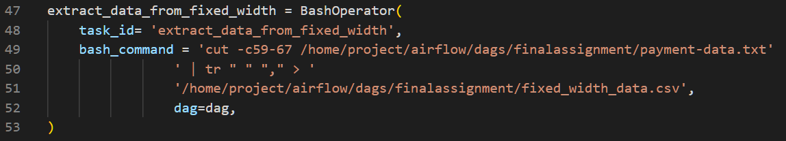

### 3. Data Transformation and Loading
[cite_start]After extraction, the disparate data streams are merged and normalized[cite: 446, 465].

* [cite_start]**Consolidation:** Uses the `paste` command to merge columns from the three intermediate files into a single `extracted_data.csv` file[cite: 447, 461].
* [cite_start]**Transformation:** Applies the `tr` utility to normalize the `vehicle_type` field to uppercase, creating the final `transformed_data.csv` in the staging area[cite: 465, 466].

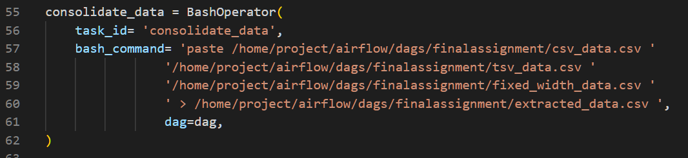
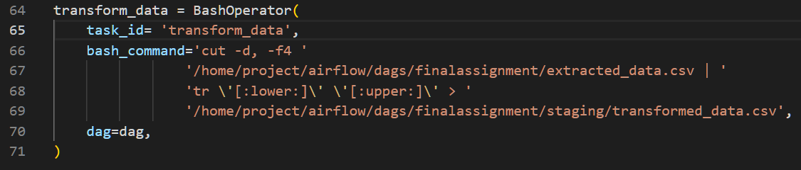

### 4. Pipeline Orchestration
Defined task dependencies to ensure the logical flow of execution:
[cite_start]`unzip_data` >> `extract_tasks` >> `consolidate_data` >> `transform_data`[cite: 469].

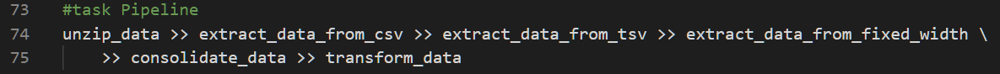

### 5. Deployment and Execution
The DAG was deployed, unpaused, and triggered via the Airflow CLI/UI. [cite_start]The execution was monitored to ensure all tasks completed successfully (green state)[cite: 480, 483].

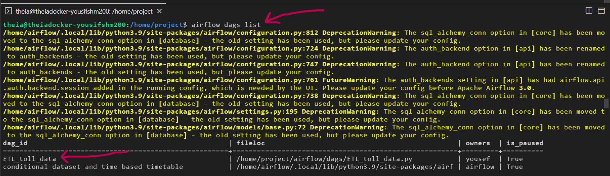
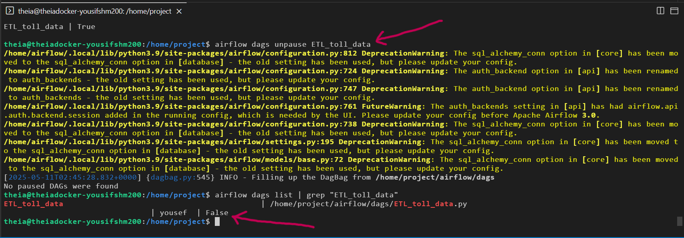
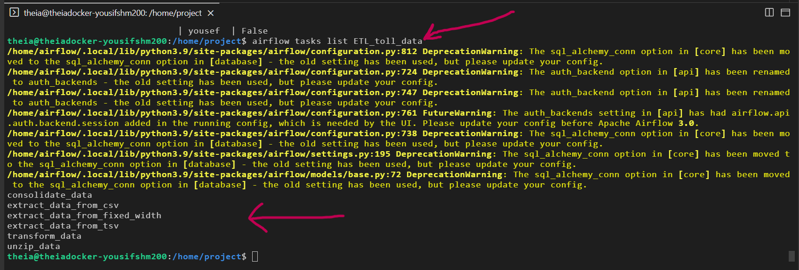
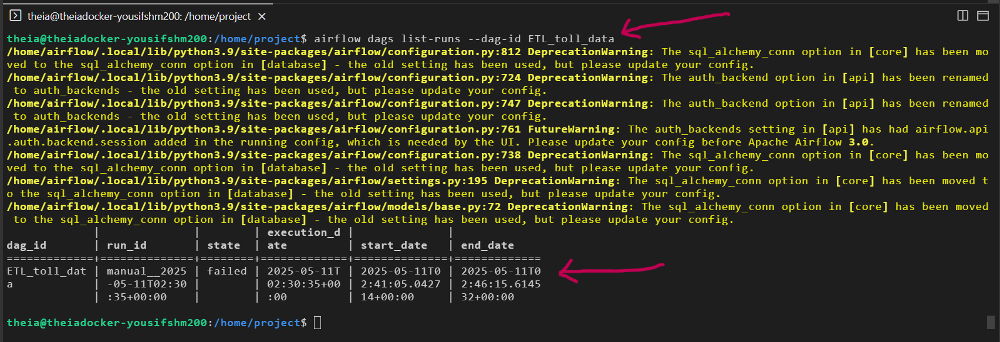

## Key Learning Outcomes

* **Airflow Orchestration:** Defining DAGs, scheduling intervals, and managing task dependencies.
* **BashOperator Mastery:** Utilizing Linux shell commands (`cut`, `paste`, `tr`) within Airflow for efficient file manipulation.
* **Data Integration:** Handling and normalizing data from multiple disparate formats (CSV, TSV, Fixed-Width) into a unified schema.
* **Pipeline Monitoring:** Using the Airflow UI to trigger runs and debug logs.

## Notes

* [cite_start]All data processing was performed in a Linux-based staging environment[cite: 410].
* [cite_start]The pipeline relies on `curl` for initial data ingestion from the source object storage[cite: 419].
