# Data Warehouse Fundamentals Capstone

This project is the final hands-on assignment for the **Data Warehouse Fundamentals** course, part of the **IBM Data Engineering Professional Certificate**. It demonstrates the complete lifecycle of a data warehousing project, from conceptual design and schema implementation to data loading and advanced reporting using PostgreSQL.

## Project Scenario

I acted as a Data Engineer for a solid waste management company in Brazil. The company operates a fleet of trucks to collect and transport waste across major cities and requires a centralized Data Warehouse to generate critical business reports.

The project evolved in two phases:
1.  **Design Phase:** Designing a Star Schema to support reports on waste collection trends (by city, truck type, station, and time).
2.  **Implementation Phase:** Adapting to an operational change where data sources were updated, requiring the implementation of a revised schema (DimDate, DimTruck, DimStation) and loading actual operational data from CSV files.

## Tools & Technologies

* **Database:** PostgreSQL (RDBMS)
* **Modeling:** Star Schema Design
* **Management:** pgAdmin 4
* **Querying:** SQL (Grouping Sets, Rollup, Cube, Materialized Views)
* **Environment:** IBM Skills Network Labs (Theia/Docker)

## Project Tasks & Implementation

The project is structured into four key exercises covering design, implementation, ETL, and reporting.

### Part 1: Data Warehouse Design (Star Schema)
The initial requirement was to design a Star Schema to analyze waste collection efficiency. I identified the grain (daily) and defined the attributes for dimensions and fact tables.

* **Dimension Modeling:** Designed `MyDimDate`, `MyDimWaste`, and `MyDimZone` to capture temporal, waste type, and geographical contexts.
* **Fact Modeling:** Designed `MyFactTrips` to store quantitative measures like waste collected in tons.

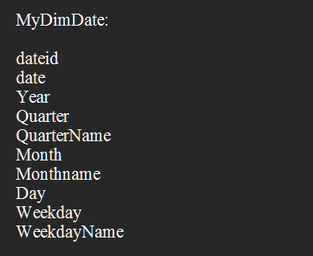

### Part 2: Schema Implementation
Using PostgreSQL, I translated the conceptual design into physical database tables.

* **DDL Execution:** Wrote and executed `CREATE TABLE` statements for the designed schema.

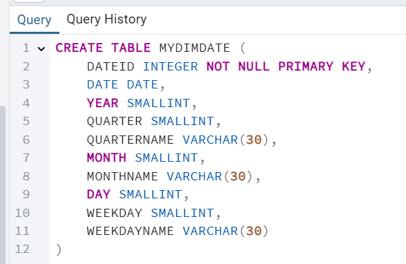

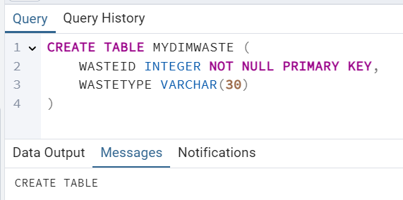

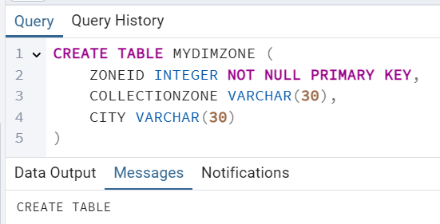

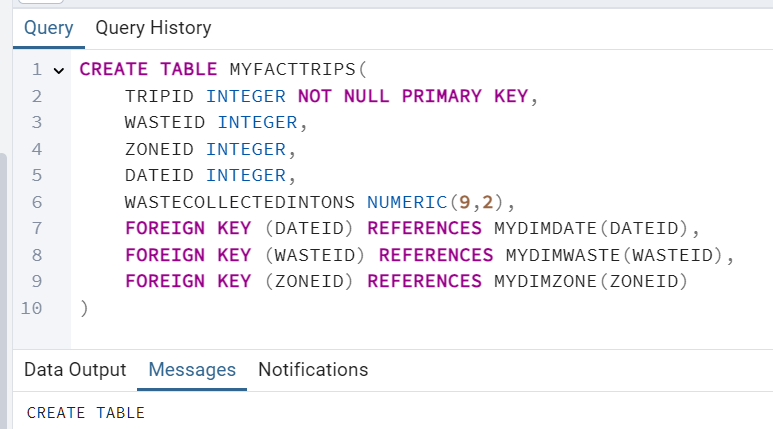

### Part 3: ETL & Data Loading
Due to an operational shift in the data source format, the schema was refactored to align with provided CSV extracts (`DimDate`, `DimTruck`, `DimStation`, `FactTrips`).

* **Schema Refactoring:** Created a new production database `FinalProject` with the updated table structures.
* **Data Loading:** Performed bulk data loading from CSV files into the dimension and fact tables.
* **Verification:** Validated data integrity by querying the first 5 rows of each populated table.

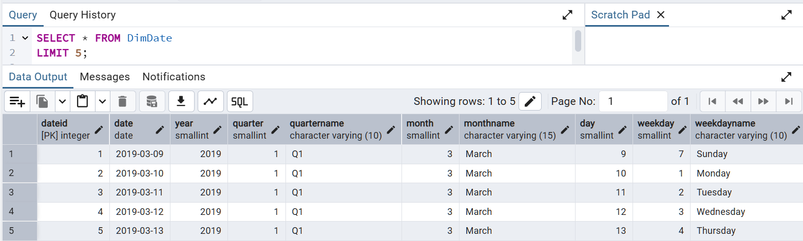

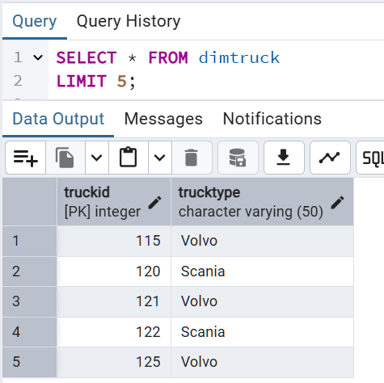

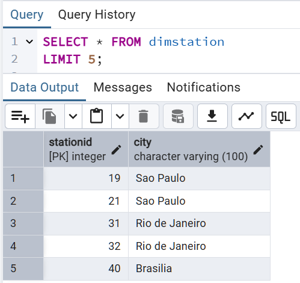

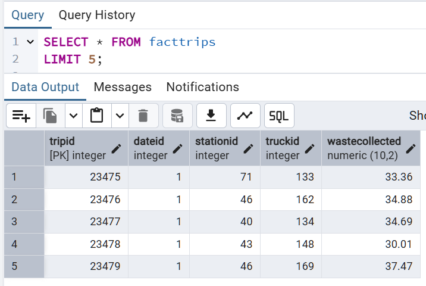

### Part 4: Advanced Aggregation & Optimization
Developed complex analytical queries to support business reporting requirements using advanced SQL grouping extensions.

* **Grouping Sets:** Generated a report aggregating waste collected by `StationID` and `TruckType`.
  
    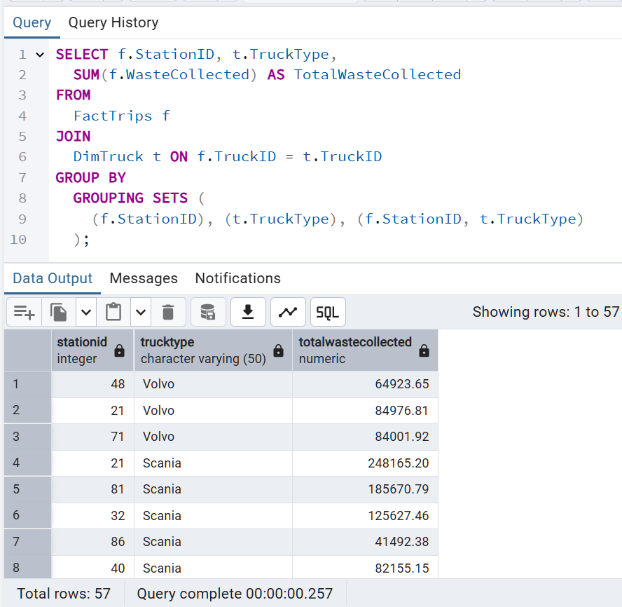

* **Rollup:** Created a hierarchical report summarizing waste collected by `Year`, `City`, and `StationID`, providing subtotals at each level.
  
    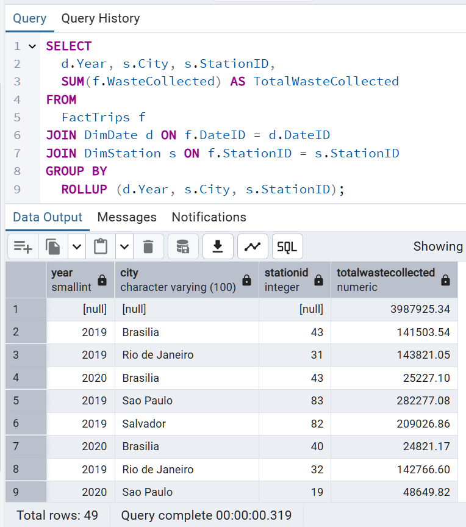

* **Cube:** Produced a multidimensional analysis of average waste collected across all combinations of `Year`, `City`, and `StationID`.
  
    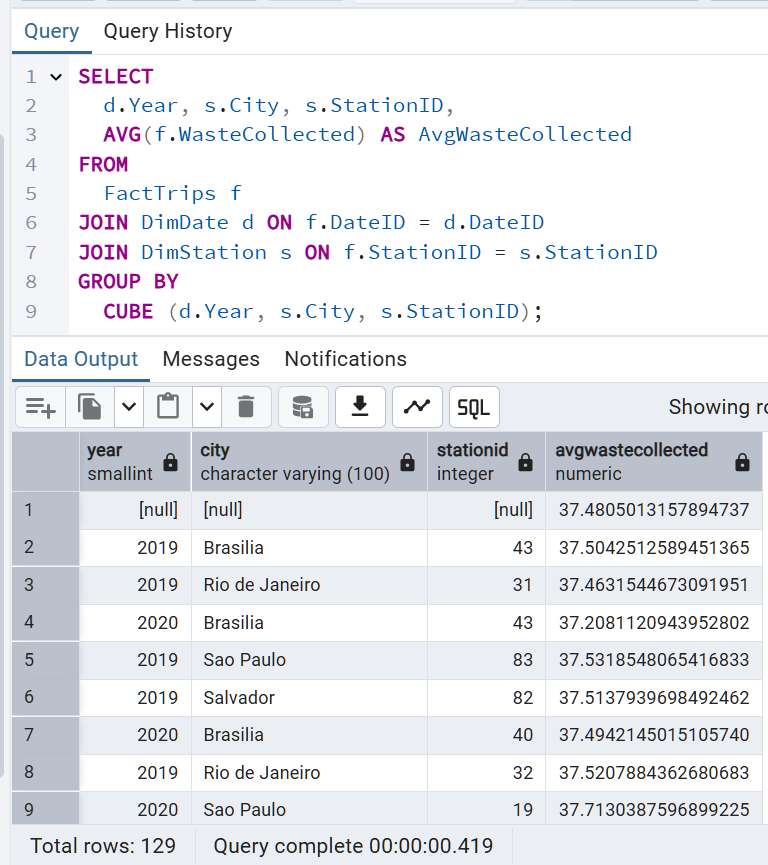

* **Performance Optimization:** Created a **Materialized View** (`max_waste_stats`) to store pre-computed max waste statistics, improving query performance for frequent access.
  
    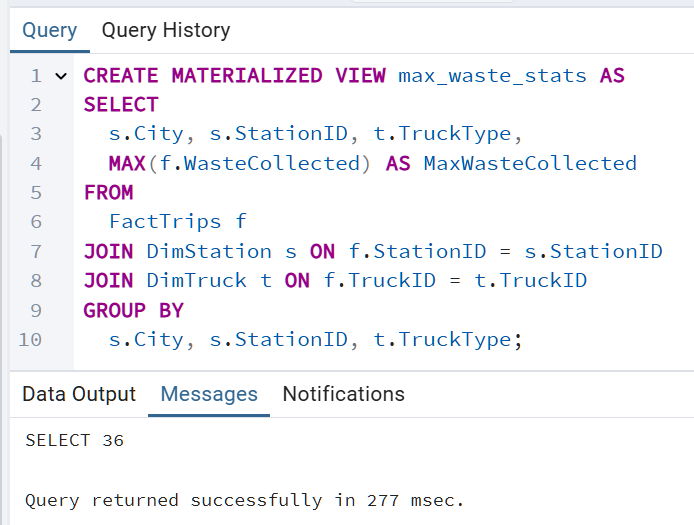

## Key Learning Outcomes

* **Dimensional Modeling:** Designing effective Star Schemas to support specific business queries.
* **Schema Evolution:** Adapting database designs to changing data source formats.
* **Advanced SQL:** Mastery of `GROUPING SETS`, `ROLLUP`, and `CUBE` for analytical reporting.
* **Performance Tuning:** Implementing Materialized Views to optimize read-heavy workloads.
* **ETL Operations:** Loading external flat file data into a relational data warehouse.

## Notes

* The shift in table names between Part 2 and Part 3 reflects a simulated real-world requirement change, demonstrating flexibility in data engineering workflows.
* All aggregation queries were executed against the populated `FactTrips` table in the `FinalProject` database.
