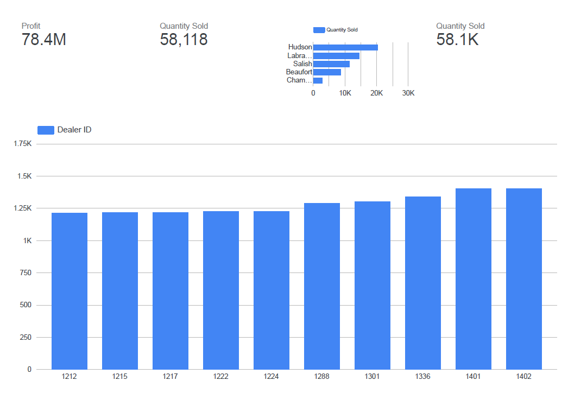
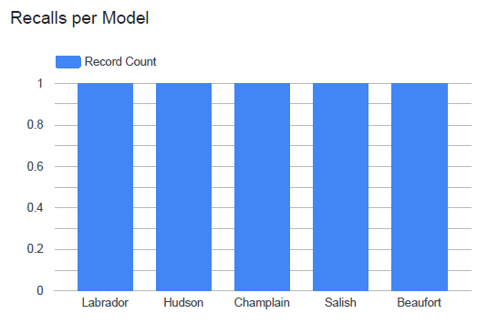
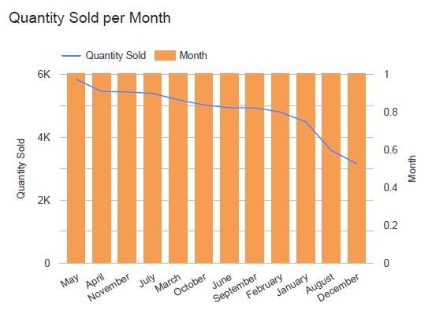
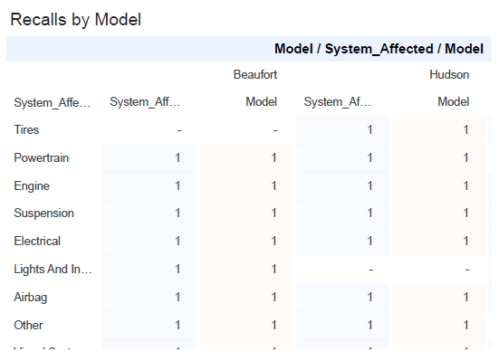
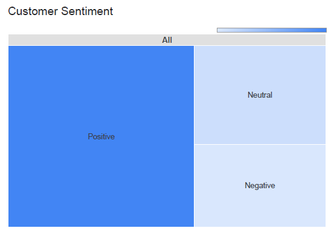

# Business Intelligence Dashboard with Google Looker Studio

This project is part of the **IBM Data Engineering Professional Certificate** and focuses on the **Business Intelligence (BI)** phase of the data pipeline.

The goal was to ingest processed automotive data, model the relationships, and build an interactive dashboard using **Google Looker Studio**. This dashboard provides stakeholders with real-time insights into sales performance, product quality (recalls), and customer sentiment.

## Project Scenario

As a Data Engineer/BI Developer for a national automotive dealership network, the management requires a centralized view of business performance.
The dashboard needs to answer three key questions:
1.  **Sales Health:** Which models and dealers are driving the most revenue?
2.  **Product Quality:** Are there specific mechanical systems causing vehicle recalls?
3.  **Customer Voice:** What is the overall sentiment trend among buyers?

## Tools & Technologies

* **BI Tool:** Google Looker Studio.
* **Data Source:** Processed CSV/Google Sheets.
* **Concepts:** Data Modeling, Aggregation, Time-Series Analysis, Pivot Tables.

## Project Tasks & Implementation

### 1. KPI Calculation & High-Level Metrics
Designed Scorecards to track high-level indicators immediately upon opening the dashboard.
* [cite_start]**Total Profit:** Calculated net profit across all dealers, reaching **78.4M**.
* [cite_start]**Volume:** Tracked total units sold (**58,118** vehicles)[cite: 675].

### 2. Comparative Sales Analysis
Implemented bar charts to compare performance across different dimensions:
* [cite_start]**Sales by Model:** Identified "Hudson" as the top-selling model (~20k units), followed by "Labrador"[cite: 686].
* [cite_start]**Sales by Dealer:** Analyzed distribution across dealer IDs (e.g., Dealer 1401, 1402) to identify top performers[cite: 702].

### 3. Time-Series Trend Analysis
Created a Combo Chart to visualize the correlation between months and quantity sold.
* [cite_start]**Trend:** The line chart reveals the fluctuation of sales volume throughout the year (May through December)[cite: 716, 733].

### 4. Quality Control & Recall Analysis
Developed a "Risk & Compliance" section to track vehicle defects.
* [cite_start]**Recall Matrix:** Used a pivot table/heatmap to cross-reference **Car Models** (Beaufort, Hudson) against **Affected Systems** (Engine, Tires, Electrical)[cite: 740].
* **Insight:** This helps engineering teams pinpoint that "Hudson" and "Beaufort" models had specific issues with "Powertrain" and "Airbags".

### 5. Customer Sentiment Analysis
Visualized unstructured data using a Treemap to categorize customer feedback.
* [cite_start]**Sentiment Distribution:** Segmented feedback into **Positive** (dominant share), **Neutral**, and **Negative** to gauge brand health[cite: 734, 736].

## Key Learning Outcomes

* **Data Modeling for BI:** Connecting and defining field types (currency, geo, text) for accurate reporting.
* **Dashboard Design:** Arranging visuals logically (KPIs at top, trends in middle, details at bottom) for better User Experience (UX).
* **Aggregation Logic:** Using `COUNT`, `SUM`, and calculated fields to derive meaningful metrics.
* **Cross-Filtering:** Enabling interactive filtering where selecting a specific "Car Model" updates the entire dashboard.

## Notes

* The dashboard highlights a significant positive sentiment despite the recorded recalls, suggesting effective customer service handling.
* The data reveals a sales dip in the later months, indicating a potential seasonal trend to investigate further.
