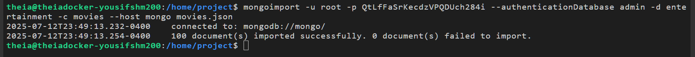
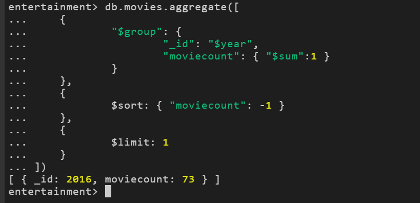
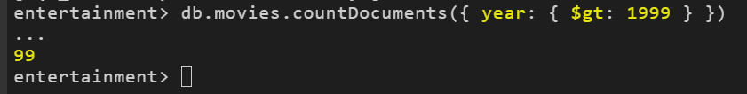
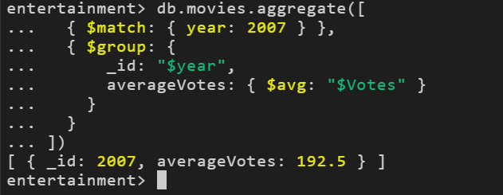
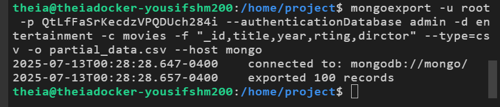
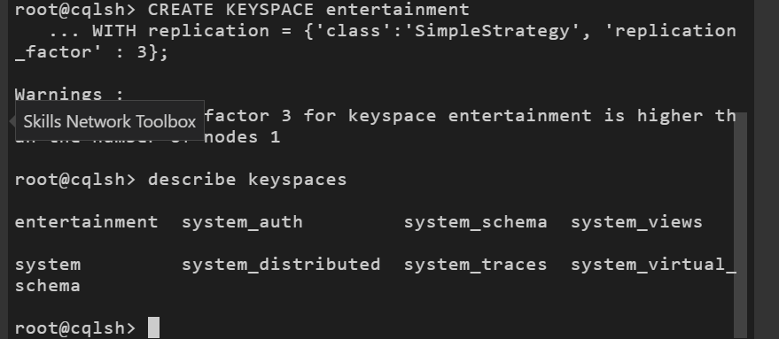
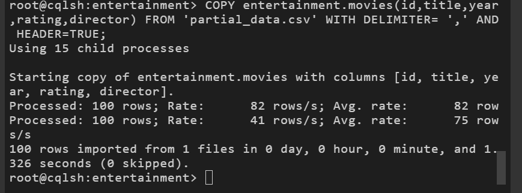
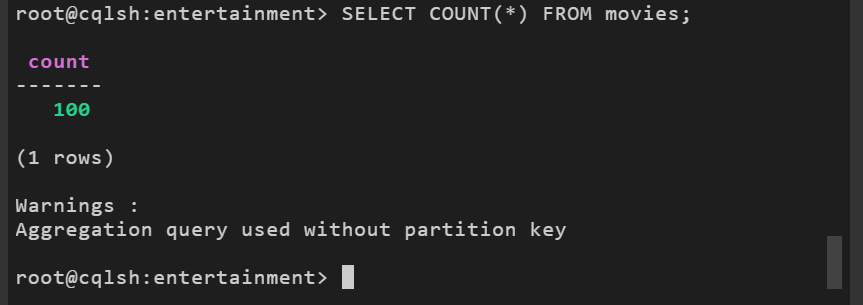
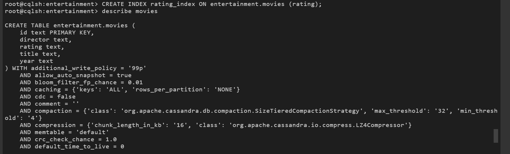
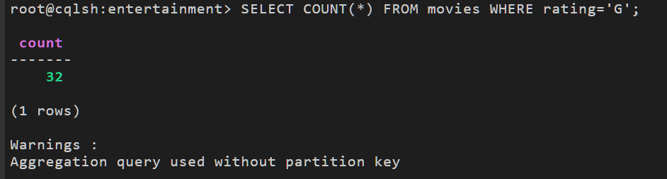

# NoSQL Data Engineering: MongoDB & Cassandra Pipeline

This project is the final capstone for the **Introduction to NoSQL Databases** course, part of the **IBM Data Engineering Professional Certificate**. It focuses on building a data migration pipeline that moves and transforms semi-structured data between a Document Store (MongoDB) and a Wide-Column Store (Apache Cassandra).

## Project Scenario

I assumed the role of a Data Engineer at a data analytics consulting firm. The firm manages diverse data sources for clients and requires an agile workflow to handle unstructured data.
The specific business requirement was to ingest raw movie metadata (JSON), perform analytics in a flexible document store, and then migrate a curated subset of that data into a highly scalable wide-column store for high-performance production querying.

## Tools & Technologies

* **Document Database:** MongoDB (v3.6)
* **Wide-Column Store:** Apache Cassandra (v4.1)
* **CLI Tools:** `mongosh`, `mongoimport`, `mongoexport`, `cqlsh`
* **Data Formats:** JSON (Semi-structured), CSV (Structured)
* **Languages:** MQL (MongoDB Query Language), CQL (Cassandra Query Language)

## Project Tasks & Implementation

The project is divided into two distinct phases: Data Processing in MongoDB and Data Migration/Optimization in Cassandra.

### Part 1: MongoDB (Ingestion & Analytics)
The first phase involved setting up the document store to handle the raw `movies.json` dataset.

**1. Data Ingestion**
Imported the `movies.json` file into the `entertainment.movies` collection using the `mongoimport` utility.

**2. Aggregation: Peak Release Year**
Executed an aggregation pipeline to group movies by year and sort them to identify the year with the highest volume of releases (Result: 2016).

**3. Filtering: Millennium Analysis**
Performed a filter query to count the number of movies released after the year 1999.

**4. Complex Aggregation: Average Voting**
Constructed a multi-stage aggregation pipeline (`$match`, `$group`, `$avg`) to calculate the average number of votes for movies released in 2007.

**5. ETL Export (Migration Prep)**
Exported a cleaned subset of the data (fields: `_id`, `title`, `year`, `rating`, `director`) to a CSV file (`partial_data.csv`) using `mongoexport`. This prepared the data for migration to the strict schema of Cassandra.

---

### Part 2: Apache Cassandra (Migration & Optimization)
The second phase focused on modeling the data in a wide-column store and optimizing it for specific query patterns.

**6. Keyspace Setup**
Designed and created the `entertainment` Keyspace using `SimpleStrategy` replication.

**7. Schema Definition & Import**
Defined the table schema for `movies` and used the `COPY` command to ingest the `partial_data.csv` file generated in the previous phase.

**8. Data Verification**
Verified the integrity of the migration by validating the row count in the new table.

**9. Performance Optimization (Secondary Indexing)**
In Cassandra, filtering by non-primary key columns is inefficient. I created a **Secondary Index** on the `rating` column to enable high-performance filtering queries.

**10. Filtered Querying**
Executed an optimized CQL query to count specific movie types (Rated 'G') leveraging the newly created index.

## Key Learning Outcomes

* **Polyglot Persistence:** Experience handling data across different NoSQL paradigms (Document vs. Wide-Column).
* **ETL Operations:** Moving data between systems using command-line utilities (`mongoexport` / `COPY`).
* **Query Languages:** Proficiency in both MQL (JSON-based querying) and CQL (SQL-like querying).
* **Database Internals:** Understanding the need for Secondary Indexes in Cassandra due to its partition-based architecture.
* **Schema Design:** Transitioning from schema-less (MongoDB) to schema-on-write (Cassandra).

## Notes

* The environment utilized Docker containers to host both database services.
* The migration logic highlights a common real-world pattern: using MongoDB for flexible raw data storage and Cassandra for specific, high-scale read patterns.
